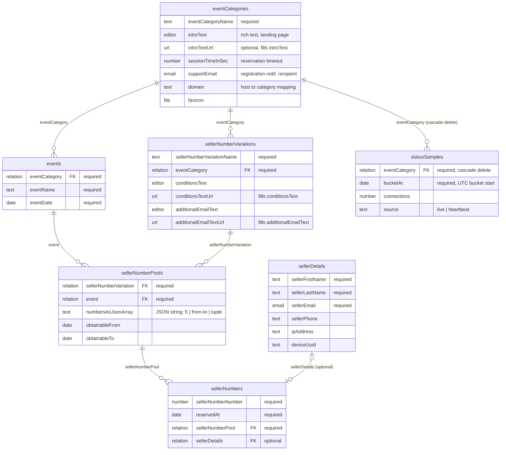

# Data Model

ER diagram of all PocketBase collections, their fields, and relations. Source: `docs/ARCHITECTURE.md`
§ Database collections, cross-checked against `pb_migrations/`.

## Notes

- **Collection IDs**: `eventCategories` = `pbc_3505075978`, `events` = `pbc_1687431684`,
  `sellerNumberVariations` = `pbc_1269879477`, `sellerNumberPools` = `pbc_1981446857`,
  `sellerNumbers` = `pbc_492105405`, `sellerDetails` = `pbc_418131918`.
- `sellerNumberPools.numbersAsJsonArray` is a **text** field holding a JSON array, not a native
  PocketBase relation/array type — it must be `JSON.parse`d. See `CLAUDE.md` pitfall #4.
- `sellerDetails → sellerNumbers` is 0/1-to-1 in practice (one seller registers once per number),
  modeled as an optional relation on `sellerNumbers`, not the reverse. There is no direct path
  from `sellerDetails` back to an event category — only via `sellerNumbers → sellerNumberPools →
  event/sellerNumberVariation → eventCategory`.
- `statusSamples` is an append-only time series with no downstream relations; it is deleted in
  cascade when its `eventCategory` is deleted, and swept by the `statusSamplesRetention` cron
  after 90 days.
- `sellerNumberPools.listRule` and `sellerNumbers.listRule` are both `""` (public) — see
  `docs/ARCHITECTURE.md` § public-status.
