# Data Model

ER diagram of all PocketBase collections, their fields, and relations. Source: `docs/ARCHITECTURE.md`
§ Database collections, cross-checked against `pb_migrations/`.

```mermaid
erDiagram
    eventCategories ||--o{ events : "eventCategory"
    eventCategories ||--o{ sellerNumberVariations : "eventCategory"
    eventCategories ||--o{ statusSamples : "eventCategory (cascade delete)"
    events ||--o{ sellerNumberPools : "event"
    sellerNumberVariations ||--o{ sellerNumberPools : "sellerNumberVariation"
    sellerNumberPools ||--o{ sellerNumbers : "sellerNumberPool"
    sellerDetails |o--o| sellerNumbers : "sellerDetails (optional)"
    permanentNumberHolders ||--o{ permanentNumbers : "holder"
    sellerNumberVariations ||--o{ permanentNumbers : "sellerNumberVariation"
    permanentNumberHolders |o--o{ sellerDetails : "permanentNumberHolder (optional)"
    events |o--o{ syncLog : "event (optional)"
    permanentNumbers ||--o{ permanentNumberMarkets : "permanentNumber (cascade delete)"
    eventCategories ||--o{ marketStats : "eventCategory"
    permanentNumberHolders |o--o{ permanentNumberMarkets : "holder (optional)"
    eventCategories ||--o{ marketTopSellers : "eventCategory"

    eventCategories {
        text eventCategoryName "required"
        editor introText "rich text, landing page"
        url introTextUrl "optional, fills introText"
        number sessionTimeInSec "reservation timeout"
        email supportEmail "registration notif. recipient"
        text domain "host to category mapping"
        file favicon
    }

    events {
        relation eventCategory FK "required"
        text eventName "required"
        date eventDate "required"
    }

    sellerNumberVariations {
        text sellerNumberVariationName "required"
        relation eventCategory FK "required"
        editor conditionsText
        url conditionsTextUrl "fills conditionsText"
        editor additionalEmailText
        url additionalEmailTextUrl "fills additionalEmailText"
    }

    sellerNumberPools {
        relation sellerNumberVariation FK "required"
        relation event FK "required"
        text numbersAsJsonArray "JSON string: 5 | from-to | tuple"
        date obtainableFrom
        date obtainableTo
    }

    sellerNumbers {
        number sellerNumberNumber "required"
        date reservedAt "required"
        relation sellerNumberPool FK "required"
        relation sellerDetails FK "optional"
    }

    sellerDetails {
        text sellerFirstName "required"
        text sellerLastName "required"
        email sellerEmail "required"
        text sellerPhone
        text ipAddress
        text deviceUuid
        bool isStaff "ma column of the exports"
        relation permanentNumberHolder FK "optional, set by materialise"
    }

    permanentNumberHolders {
        text holderFirstName "required"
        text holderLastName "required"
        email holderEmail "required"
        text holderPhone
        text holderFirstNameHash "sha256 of normalised name"
        text holderLastNameHash "sha256 of normalised name"
        bool isStaff
        text holderNote
    }

    permanentNumbers {
        relation sellerNumberVariation FK "required - variation, not event"
        number permanentNumberNumber "required"
        relation holder FK "required"
        select status "aktiv | pausiert | freigegeben | gesperrt"
        date heldSince
        date releasedAt
        bool reviewFlag "advisory, from the last statistics sync"
        date reviewedAt
    }

    permanentNumberMarkets {
        relation permanentNumber FK "required, cascade delete"
        text market "YYYY-Mon, required"
        relation event FK "optional"
        relation holder FK "optional, resolved from the hashes"
        text firstNameHash "who sold under the number that market"
        text lastNameHash
        select holderMatch "holder | nameChange | mismatch"
        number itemsSold
        number revenueCents
    }

    marketTopSellers {
        relation eventCategory FK "required"
        text market "YYYY-Mon, required"
        relation event FK "optional"
        number number
        number rankRevenue
        number rankItems
        number itemsSold
        number revenueCents
        text firstNameHash
        text lastNameHash
    }

    marketStats {
        relation eventCategory FK "required"
        text market "YYYY-Mon, required"
        relation event FK "optional"
        number sellers
        number itemsMean
        number itemsMedian
        number revenueCentsMean
        number revenueCentsMedian
        number permanentSellers
        number permanentItemsMean
        number permanentItemsMedian
        number permanentRevenueCentsMean
        number permanentRevenueCentsMedian
    }

    syncLog {
        select direction "out | in"
        select kind "export-assignment | export-events | export-ack | permanent-numbers-import | permanent-numbers-materialise | permanent-numbers-statistics"
        relation event FK "optional"
        text client "superuser or apiClients email"
        text checksum "sha256 of the export"
        number rowCount
        bool dryRun
        select status "ok | error"
        json summary "counters only, never a name"
        date finishedAt
    }

    statusSamples {
        relation eventCategory FK "required, cascade delete"
        date bucketAt "required, UTC bucket start"
        number connections
        text source "live | heartbeat"
    }
```

## Notes

- **Collection IDs**: `eventCategories` = `pbc_3505075978`, `events` = `pbc_1687431684`,
  `sellerNumberVariations` = `pbc_1269879477`, `sellerNumberPools` = `pbc_1981446857`,
  `sellerNumbers` = `pbc_492105405`, `sellerDetails` = `pbc_418131918`.
- `sellerNumberPools.numbersAsJsonArray` is a **text** field holding a JSON array, not a native
  PocketBase relation/array type — it must be `JSON.parse`d. See `CLAUDE.md` pitfall #4.
- `sellerDetails → sellerNumbers` is 0/1-to-1 in practice (one seller registers once per number),
  modeled as an optional relation on `sellerNumbers`, not the reverse. There is no direct path
  from `sellerDetails` back to an event category — only via `sellerNumbers → sellerNumberPools →
  event/sellerNumberVariation → eventCategory`.
- `statusSamples` is an append-only time series with no downstream relations; it is deleted in
  cascade when its `eventCategory` is deleted, and swept by the `statusSamplesRetention` cron
  after 90 days.
- `sellerNumberPools.listRule` and `sellerNumbers.listRule` are both `""` (public) — see
  `docs/ARCHITECTURE.md` § public-status. A materialised Dauernummer is therefore visible as
  *taken* like any other number, nothing more.
- `permanentNumbers` is unique on `(sellerNumberVariation, permanentNumberNumber)`; that index,
  not a check in code, makes the register import idempotent. `permanentNumberHolders`,
  `permanentNumbers`, `permanentNumberMarkets`, `marketStats`, `marketTopSellers` and `syncLog`
  are superuser-only on all five rules.
- `permanentNumberMarkets` keeps raw per-market figures (rolling four per number, kept by the
  push); averages, medians and the trend are computed on read — no aggregate is stored twice.
- Name hashes (`permanentNumberHolders`, `permanentNumberMarkets`, `marketTopSellers`) all use
  the one exchange normalisation in `permanent-numbers-core.js` (`normaliseName`): lowercase,
  ä/ö/ü/ß transliterated, NFD with combining marks dropped, then everything outside `[a-z0-9]`
  removed. The cash-desk side computes the same; the KKM-legacy plan carries the test vectors.
